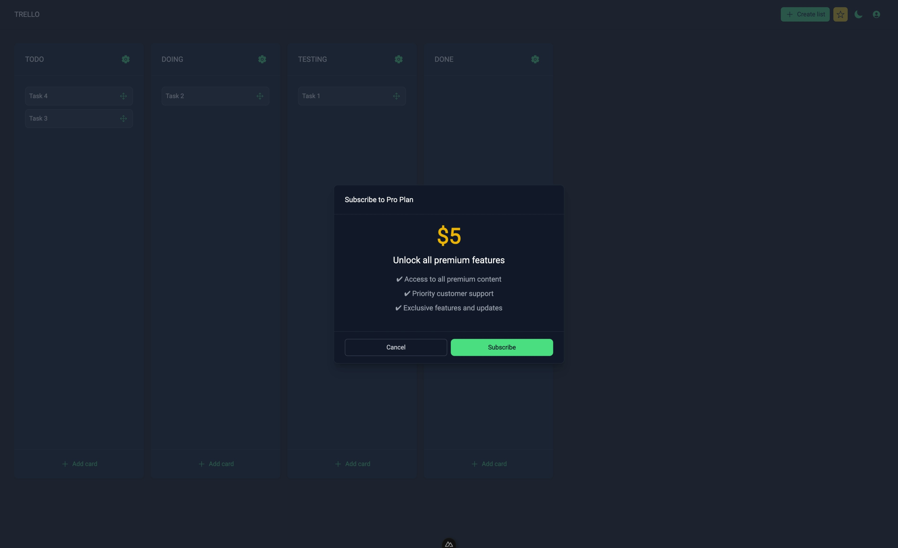

# Trello Clone - Nuxt 3 Application



This project is a **fullstack Trello-like clone** built with **Nuxt 3**. It offers features for managing tasks with drag-and-drop functionality, authentication, and a modern UI. The app uses **MongoDB** as its database and **Mongoose** as its ORM. Authentication is handled via **Sidebase/nuxt-auth**, and it integrates modern libraries and tools like **NuxtUI**, **TailwindCSS**, and more.

## Features

- **Fullstack Application** built with **Nuxt 3**
- Modern **UI components** from **NuxtUI**
- **TailwindCSS** for responsive design
- **MongoDB** as the database with **Mongoose ORM**
- **Sidebase/nuxt-auth** for authentication
- Drag-and-drop functionality using **vuedraggable**
- Secure password management with **bcryptjs**
- Server-side rendering and static site generation
- Stripe integration for subscription management
- ESLint integration for code linting

## Tech Stack

-  **Nuxt 3**: Framework for building Vue.js applications
-  **NuxtUI**: A modern UI library for Nuxt
-  **TailwindCSS**: Utility-first CSS framework
-  **MongoDB**: NoSQL database
-  **Mongoose ORM**: Object Data Modeling (ODM) for MongoDB
-  **Sidebase/nuxt-auth**: Authentication management
-  **vuedraggable**: Drag-and-drop feature
-  **Stripe**: Payment gateway for subscription services
-  **Typescript**: Type safety for better development experience
-  **ESLint**: Linting tool for maintaining code quality

## Installation

1. Install dependencies:
```bash
pnpm install
```

2. Set up environment variables:
Create a .env file and add your environment variables (for example, MongoDB URI, Stripe keys, etc.).
```bash
MONGODB_URI=
AUTH_SECRET=
AUTH_ORIGIN=
PIXABAY_API_KEY=

STRIPE_PRICE_ID=
STRIPE_PUBLIC_KEY=
STRIPE_SECRET_KEY=
STRIPE_WEBHOOK_SECRET=
```

3. Run the development server:
```bash
pnpm run dev
```
